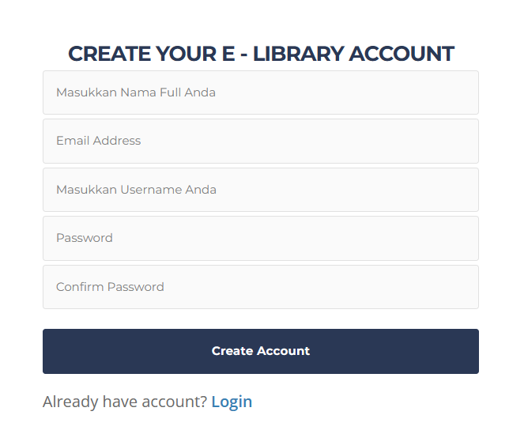
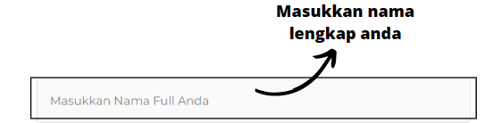
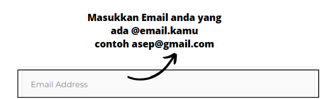
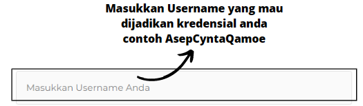
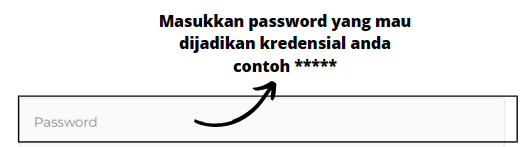
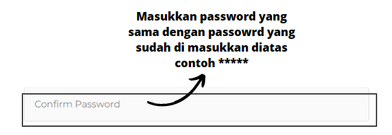

# Panduan Pembuatan Akun

---

Silahkan klik masalah yang anda hadapi saat menggunakan website ini.

- [Registrasi Akun](#registrasi-akun)
- [Login ke akun anda](#login-akun)
- [Logout Akun anda](#logout-akun)
- [Lupa password anda](#lupa-password)
- [Verifikasi Akun anda](#verifikasi-akun)

---

## tampilan lengkap form registrasi



<!-- ```
Fenced code blocks are like Standard
Markdown’s regular code blocks, except that
they’re not indented and instead rely on
start and end fence lines to delimit the
code block.
``` -->

## Registrasi Akun

dalam pembuatan akun, persiapkan 5 data berikut:

- Nama Lengkap



- Email



- Username **digunakan untuk masuk ke krediansi akun anda **



- Password



- Password Konfirmasi **harus sama dengan password yang anda inputkan**



## Login Akun

---

## Logout Akun

---

## Lupa Password

---

## Verifikasi Akun

```

```
